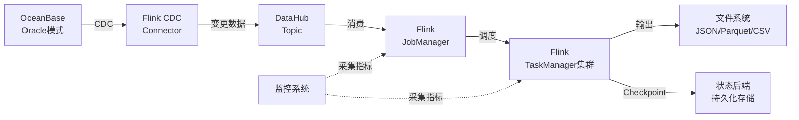
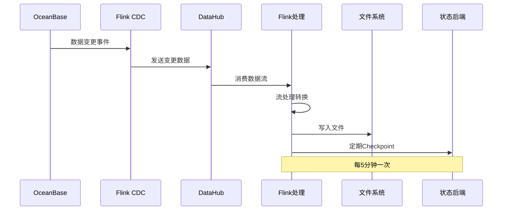
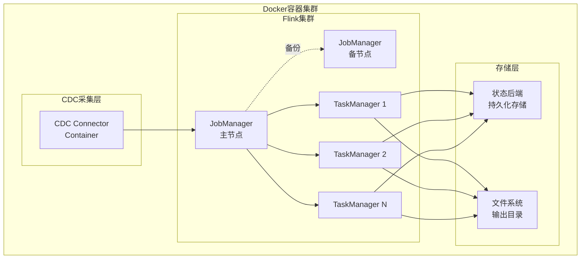
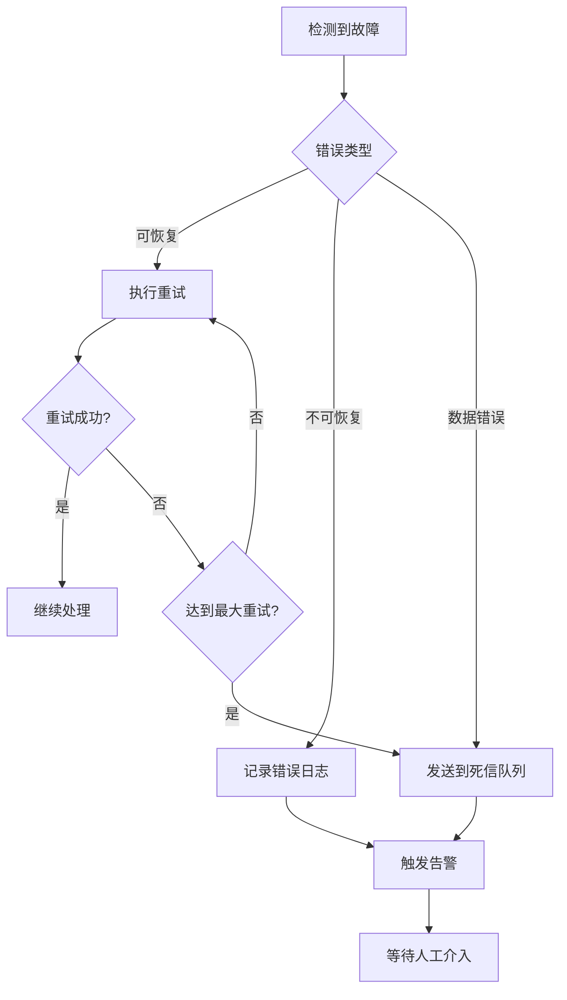

# 设计文档

## 概述

实时数据管道系统是一个基于Apache Flink的流处理平台，用于从OceanBase数据库捕获变更数据（CDC），通过阿里云DataHub进行数据传输，使用Flink进行流处理，最终输出到文件系统。系统采用Docker容器化部署，设计支持500亿级别的数据处理，具备高可用性、容错性和可扩展性。

### 核心设计原则

1. **简化架构**: 采用DataHub + Flink的两层架构，避免引入过多中间件
2. **容器化优先**: 所有组件均采用Docker部署，简化运维
3. **容错为先**: 利用Flink的Checkpoint机制保证数据不丢失
4. **水平扩展**: 通过增加TaskManager和调整并行度实现扩展
5. **可观测性**: 暴露完整的监控指标，便于运维

## 架构

### 整体架构



### 数据流架构



### 部署架构



## 组件和接口

### 1. CDC采集组件

**职责**: 从OceanBase数据库捕获变更数据并发送到DataHub

**接口**:
```java
interface CDCCollector {
    // 启动CDC采集
    void start(DatabaseConfig dbConfig, DataHubConfig dhConfig);
    
    // 停止CDC采集
    void stop();
    
    // 获取采集状态
    CollectorStatus getStatus();
    
    // 获取采集指标
    CollectorMetrics getMetrics();
}
```

**配置参数**:
- `database.host`: OceanBase数据库主机地址
- `database.port`: 数据库端口
- `database.username`: 数据库用户名
- `database.password`: 数据库密码
- `database.schema`: 要监控的Schema
- `database.tables`: 要监控的表列表
- `datahub.endpoint`: DataHub服务端点
- `datahub.accessId`: DataHub访问ID
- `datahub.accessKey`: DataHub访问密钥
- `datahub.project`: DataHub项目名称
- `datahub.topic`: DataHub主题名称
- `retry.maxAttempts`: 最大重试次数（默认3次）
- `retry.backoff`: 重试间隔（默认2秒）

**实现细节**:
- 使用Flink CDC Connector for OceanBase捕获变更
- 支持INSERT、UPDATE、DELETE三种操作类型
- 变更数据在5秒内发送到DataHub
- 失败时自动重试，最多3次，每次间隔2秒
- 连接断开时30秒内自动重连

### 2. DataHub集成组件

**职责**: 作为CDC数据和Flink之间的消息队列

**接口**:
```java
interface DataHubSource {
    // 创建DataHub数据源
    DataStream<ChangeEvent> createSource(
        StreamExecutionEnvironment env,
        DataHubConfig config
    );
    
    // 配置消费者组
    void setConsumerGroup(String groupName);
    
    // 设置起始位置
    void setStartPosition(StartPosition position);
}
```

**配置参数**:
- `datahub.endpoint`: DataHub服务端点
- `datahub.accessId`: 访问ID
- `datahub.accessKey`: 访问密钥
- `datahub.project`: 项目名称
- `datahub.topic`: 主题名称
- `datahub.consumerGroup`: 消费者组名称
- `datahub.startPosition`: 起始消费位置（EARLIEST/LATEST/TIMESTAMP）

**数据格式**:
```json
{
  "type": "INSERT|UPDATE|DELETE",
  "database": "schema_name",
  "table": "table_name",
  "timestamp": 1234567890,
  "before": { /* 变更前数据，仅UPDATE和DELETE */ },
  "after": { /* 变更后数据，仅INSERT和UPDATE */ },
  "primaryKeys": ["id"]
}
```

### 3. Flink流处理组件

**职责**: 消费DataHub数据，进行流处理，输出到文件系统

**接口**:
```java
interface FlinkPipeline {
    // 创建并启动Flink作业
    void execute(PipelineConfig config) throws Exception;
    
    // 停止Flink作业
    void stop(SavepointMode mode);
    
    // 获取作业状态
    JobStatus getJobStatus();
    
    // 触发Savepoint
    String triggerSavepoint(String savepointPath);
}
```

**核心处理逻辑**:
```java
// 伪代码示例
StreamExecutionEnvironment env = StreamExecutionEnvironment.getExecutionEnvironment();

// 配置Checkpoint
env.enableCheckpointing(300000); // 5分钟
env.getCheckpointConfig().setCheckpointingMode(CheckpointingMode.EXACTLY_ONCE);
env.getCheckpointConfig().setMinPauseBetweenCheckpoints(60000);
env.getCheckpointConfig().setCheckpointTimeout(600000);
env.getCheckpointConfig().setMaxConcurrentCheckpoints(1);
env.getCheckpointConfig().setTolerableCheckpointFailureNumber(3);

// 配置状态后端
env.setStateBackend(new HashMapStateBackend());
env.getCheckpointConfig().setCheckpointStorage("file:///checkpoint-dir");

// 创建数据源
DataStream<ChangeEvent> source = createDataHubSource(env, config);

// 数据处理
DataStream<ProcessedEvent> processed = source
    .keyBy(event -> event.getTable())
    .map(new EventProcessor())
    .name("Event Processor");

// 输出到文件系统
processed.addSink(createFileSink(config))
    .name("File Sink");

env.execute("Realtime Data Pipeline");
```

**配置参数**:
- `flink.parallelism`: 默认并行度
- `flink.checkpoint.interval`: Checkpoint间隔（毫秒）
- `flink.checkpoint.timeout`: Checkpoint超时时间（毫秒）
- `flink.checkpoint.minPause`: 两次Checkpoint之间的最小间隔
- `flink.checkpoint.maxConcurrent`: 最大并发Checkpoint数
- `flink.checkpoint.retainedNumber`: 保留的Checkpoint数量
- `flink.statebackend.type`: 状态后端类型（hashmap/rocksdb）
- `flink.statebackend.checkpointDir`: Checkpoint存储目录

### 4. 文件输出组件

**职责**: 将处理后的数据写入文件系统，支持多种格式

**接口**:
```java
interface FileSink {
    // 创建文件Sink
    SinkFunction<ProcessedEvent> createSink(
        OutputFormat format,
        String outputPath,
        RollingPolicy policy
    );
    
    // 配置文件滚动策略
    void setRollingPolicy(RollingPolicy policy);
    
    // 配置文件命名策略
    void setFileNamingStrategy(FileNamingStrategy strategy);
}
```

**支持的输出格式**:

1. **JSON格式**:
```json
{
  "eventType": "INSERT",
  "database": "mydb",
  "table": "users",
  "timestamp": 1234567890,
  "data": {
    "id": 1,
    "name": "张三",
    "email": "zhangsan@example.com"
  }
}
```

2. **Parquet格式**: 列式存储，适合大数据分析
3. **CSV格式**: 逗号分隔，适合简单数据交换

**文件滚动策略**:
- 大小滚动: 文件达到1GB时创建新文件
- 时间滚动: 每小时创建新文件
- 组合策略: 满足任一条件即滚动

**文件命名规则**:
```
{database}_{table}_{timestamp}_{partition}.{format}
例如: mydb_users_20250128120000_part-0.json
```

**配置参数**:
- `output.path`: 输出目录路径
- `output.format`: 输出格式（json/parquet/csv）
- `output.rolling.size`: 文件大小阈值（字节）
- `output.rolling.interval`: 时间间隔阈值（毫秒）
- `output.compression`: 压缩算法（none/gzip/snappy）
- `output.retry.maxAttempts`: 写入失败最大重试次数

### 5. 监控组件

**职责**: 收集和暴露系统运行指标

**接口**:
```java
interface MonitoringService {
    // 注册指标
    void registerMetric(String name, Metric metric);
    
    // 获取指标值
    MetricValue getMetric(String name);
    
    // 获取所有指标
    Map<String, MetricValue> getAllMetrics();
    
    // 配置告警规则
    void configureAlert(AlertRule rule);
}
```

**关键指标**:
- `records.in.rate`: 每秒输入记录数
- `records.out.rate`: 每秒输出记录数
- `latency.p50`: 端到端延迟P50（毫秒）
- `latency.p99`: 端到端延迟P99（毫秒）
- `checkpoint.duration`: Checkpoint耗时（毫秒）
- `checkpoint.success.rate`: Checkpoint成功率（百分比）
- `backpressure.level`: 反压级别（0-1）
- `taskmanager.cpu.usage`: TaskManager CPU使用率
- `taskmanager.memory.usage`: TaskManager内存使用率
- `failed.records.count`: 失败记录数

**告警规则**:
- 数据延迟超过60秒
- Checkpoint失败率超过10%
- 反压级别超过0.8
- TaskManager CPU使用率超过80%

## 数据模型

### ChangeEvent（变更事件）

```java
class ChangeEvent {
    String eventType;        // INSERT, UPDATE, DELETE
    String database;         // 数据库名称
    String table;            // 表名称
    long timestamp;          // 事件时间戳（毫秒）
    Map<String, Object> before;  // 变更前数据
    Map<String, Object> after;   // 变更后数据
    List<String> primaryKeys;    // 主键字段列表
    String eventId;          // 事件唯一标识符
}
```

### ProcessedEvent（处理后事件）

```java
class ProcessedEvent {
    String eventType;
    String database;
    String table;
    long timestamp;
    long processTime;        // 处理时间戳
    Map<String, Object> data;    // 处理后的数据
    String partition;        // 分区信息
    String eventId;
}
```

### PipelineConfig（管道配置）

```java
class PipelineConfig {
    DatabaseConfig database;
    DataHubConfig datahub;
    FlinkConfig flink;
    OutputConfig output;
    MonitoringConfig monitoring;
}

class DatabaseConfig {
    String host;
    int port;
    String username;
    String password;
    String schema;
    List<String> tables;
}

class DataHubConfig {
    String endpoint;
    String accessId;
    String accessKey;
    String project;
    String topic;
    String consumerGroup;
}

class FlinkConfig {
    int parallelism;
    long checkpointInterval;
    long checkpointTimeout;
    int retainedCheckpoints;
    String stateBackendType;
    String checkpointDir;
}

class OutputConfig {
    String path;
    String format;
    long rollingSizeBytes;
    long rollingIntervalMs;
    String compression;
    int maxRetries;
}
```

### CollectorMetrics（采集指标）

```java
class CollectorMetrics {
    long recordsCollected;   // 已采集记录数
    long recordsSent;        // 已发送记录数
    long recordsFailed;      // 失败记录数
    double collectRate;      // 采集速率（记录/秒）
    long lastEventTime;      // 最后事件时间
    String status;           // 状态（RUNNING/STOPPED/ERROR）
}
```

### JobStatus（作业状态）

```java
class JobStatus {
    String jobId;
    String jobName;
    String state;            // RUNNING/FINISHED/FAILED/CANCELED
    long startTime;
    long duration;
    int parallelism;
    Map<String, Object> metrics;
}
```

## 正确性属性

*属性是一种特征或行为，应该在系统的所有有效执行中保持为真——本质上是关于系统应该做什么的形式化陈述。属性是人类可读规范和机器可验证正确性保证之间的桥梁。*


### 属性反思

在分析了所有验收标准后，我识别出以下可以合并的冗余属性：

1. **CDC操作捕获时间** (1.1, 1.2, 1.3): 这三个属性都是测试不同操作类型的捕获时间，可以合并为一个通用属性
2. **重试机制** (1.5, 3.7): 两个属性都测试重试次数，可以合并为一个通用的重试属性
3. **输出格式支持** (3.1, 3.2, 3.3): 三个属性都是测试格式支持，可以合并为一个参数化属性
4. **文件滚动策略** (3.4, 3.5): 两个属性都测试文件滚动，可以合并为一个综合属性
5. **指标记录** (7.2, 7.3, 7.4, 7.5): 多个指标记录属性可以合并为一个通用的指标记录属性
6. **告警触发** (7.6, 7.7): 两个告警属性可以合并为一个参数化的告警属性
7. **配置支持** (10.5, 10.6, 10.7, 10.8): 多个配置能力可以合并为一个通用的配置属性

### 正确性属性列表

**属性 1: CDC变更捕获时效性**
*对于任何* 数据库变更操作（INSERT、UPDATE、DELETE），系统应该在5秒内捕获该变更事件
**验证需求: 1.1, 1.2, 1.3**

**属性 2: UPDATE操作数据完整性**
*对于任何* UPDATE操作，捕获的变更事件应该同时包含变更前和变更后的完整数据
**验证需求: 1.2**

**属性 3: 变更数据传输**
*对于任何* 捕获的数据变更，系统应该将其发送到DataHub
**验证需求: 1.4**

**属性 4: 失败重试机制**
*对于任何* 发送或写入失败的操作，系统应该重试最多3次，每次间隔2秒
**验证需求: 1.5, 3.7**

**属性 5: 连接自动恢复**
*对于任何* 数据库连接中断事件，系统应该在30秒内自动重连
**验证需求: 1.7**

**属性 6: 数据消费完整性**
*对于任何* 发送到DataHub的变更数据，Flink应该能够消费该数据
**验证需求: 2.1**

**属性 7: 事件时间顺序保持**
*对于任何* 事件序列，Flink处理后的输出应该保持原始的时间顺序
**验证需求: 2.3, 9.4**

**属性 8: Checkpoint定期执行**
*对于任何* 运行中的Flink作业，系统应该每5分钟执行一次Checkpoint操作
**验证需求: 2.4**

**属性 9: Checkpoint失败容错**
*对于任何* Checkpoint失败事件，系统应该记录错误日志并继续处理数据
**验证需求: 2.5**

**属性 10: 处理失败数据隔离**
*对于任何* 处理失败的数据记录，系统应该将其发送到死信队列而不影响其他数据处理
**验证需求: 2.7, 3.8**

**属性 11: 多格式输出支持**
*对于任何* 配置的输出格式（JSON、Parquet、CSV），系统应该能够正确生成该格式的文件
**验证需求: 3.1, 3.2, 3.3**

**属性 12: 文件滚动策略**
*对于任何* 输出文件，当文件大小达到1GB或时间跨度达到1小时时，系统应该创建新文件
**验证需求: 3.4, 3.5**

**属性 13: 文件命名规范**
*对于任何* 生成的输出文件，文件名应该包含数据库名、表名、时间戳和分区信息
**验证需求: 3.6**

**属性 14: Checkpoint恢复一致性**
*对于任何* Flink任务失败事件，系统应该从最近的Checkpoint恢复，恢复后的状态应该与Checkpoint时刻一致
**验证需求: 4.1**

**属性 15: Checkpoint持久化**
*对于任何* 成功的Checkpoint，其数据应该被持久化存储在状态后端
**验证需求: 4.2**

**属性 16: 恢复时效性**
*对于任何* 故障恢复操作，系统应该在10分钟内完成恢复
**验证需求: 4.3**

**属性 17: Checkpoint保留策略**
*对于任何* 时刻，系统应该保留最近3个Checkpoint，自动清理更早的Checkpoint
**验证需求: 4.4**

**属性 18: 容器自动重启**
*对于任何* 容器崩溃事件，系统应该在2分钟内自动重启该容器
**验证需求: 4.5**

**属性 19: 故障事件日志记录**
*对于任何* 故障事件（连接失败、处理失败、Checkpoint失败等），系统应该记录详细的错误日志
**验证需求: 4.6**

**属性 20: JobManager故障切换**
*对于任何* 主JobManager失败事件，系统应该在30秒内切换到备用JobManager并继续服务
**验证需求: 5.3**

**属性 21: 负载告警触发**
*对于任何* 系统负载超过80%的情况，系统应该触发扩容告警
**验证需求: 5.6**

**属性 22: 零停机配置更新**
*对于任何* 配置更新操作，系统应该在不中断数据处理的情况下应用新配置
**验证需求: 5.7**

**属性 23: 动态扩展TaskManager**
*对于任何* 运行时增加TaskManager实例的操作，新实例应该能够加入集群并开始处理数据，且不影响现有数据处理
**验证需求: 6.2**

**属性 24: 动态调整并行度**
*对于任何* 运行时调整并行度的操作，新的并行度应该生效，且数据处理保持连续
**验证需求: 6.3**

**属性 25: 扩容数据连续性**
*对于任何* 扩容操作期间发送的数据，系统应该保证数据不丢失且处理连续
**验证需求: 6.6**

**属性 26: 优雅缩容**
*对于任何* 缩容操作，系统应该等待当前处理任务完成后再释放资源，不丢失正在处理的数据
**验证需求: 6.7**

**属性 27: 吞吐量指标记录**
*对于任何* 时间窗口，系统应该记录该窗口内每秒处理的记录数
**验证需求: 7.2**

**属性 28: 延迟指标记录**
*对于任何* 处理的数据记录，系统应该记录从数据库变更到文件写入的端到端延迟
**验证需求: 7.3**

**属性 29: Checkpoint指标记录**
*对于任何* Checkpoint操作，系统应该记录其成功率和耗时
**验证需求: 7.4**

**属性 30: 反压指标记录**
*对于任何* 时刻，系统应该记录当前的反压级别（0-1之间的值）
**验证需求: 7.5**

**属性 31: 延迟告警触发**
*对于任何* 数据延迟超过60秒的情况，系统应该触发告警
**验证需求: 7.6**

**属性 32: Checkpoint失败率告警**
*对于任何* Checkpoint失败率超过10%的情况，系统应该触发告警
**验证需求: 7.7**

**属性 33: 容器启动时效性**
*对于任何* 容器启动操作，系统应该在60秒内完成初始化并进入就绪状态
**验证需求: 8.5**

**属性 34: 环境变量配置**
*对于任何* 通过环境变量设置的系统参数，该参数应该在系统运行时生效
**验证需求: 8.6**

**属性 35: 至少一次语义**
*对于任何* 输入的数据记录，系统应该保证该记录至少被处理一次（可能重复但不会丢失）
**验证需求: 9.1**

**属性 36: 精确一次语义**
*对于任何* 配置了幂等性Sink的数据记录，系统应该保证该记录被精确处理一次（不重复不丢失）
**验证需求: 9.2**

**属性 37: 幂等性去重**
*对于任何* 重复的数据记录，通过幂等性操作处理后应该产生相同的结果
**验证需求: 9.3**

**属性 38: 数据不一致检测**
*对于任何* 检测到的数据不一致情况，系统应该记录详细的错误日志
**验证需求: 9.5**

**属性 39: 唯一标识符生成**
*对于任何* 处理的数据记录，系统应该为其生成全局唯一的标识符
**验证需求: 9.6**

**属性 40: 配置文件参数加载**
*对于任何* 在配置文件中设置的系统参数，系统应该正确加载并应用该参数
**验证需求: 10.1**

**属性 41: 环境变量覆盖优先级**
*对于任何* 同时在配置文件和环境变量中设置的参数，环境变量的值应该覆盖配置文件的值
**验证需求: 10.2**

**属性 42: 配置参数验证**
*对于任何* 配置参数，系统应该验证其有效性（类型、范围、格式等）
**验证需求: 10.3**

**属性 43: 无效配置拒绝**
*对于任何* 无效的配置参数，系统应该拒绝启动并返回明确的错误信息
**验证需求: 10.4**

## 错误处理

### 错误分类

系统将错误分为以下几类：

1. **可恢复错误**: 通过重试可以解决的临时性错误
   - 网络连接超时
   - DataHub临时不可用
   - 文件系统临时写入失败

2. **不可恢复错误**: 需要人工介入的错误
   - 配置参数无效
   - 认证失败
   - 磁盘空间不足

3. **数据错误**: 数据本身的问题
   - 数据格式不符合预期
   - 数据验证失败
   - 数据类型转换失败

### 错误处理策略

**重试策略**:
```java
RetryPolicy retryPolicy = RetryPolicy.builder()
    .maxAttempts(3)
    .backoff(Duration.ofSeconds(2))
    .retryOn(RecoverableException.class)
    .build();
```

**死信队列**:
- 所有重试失败的记录进入死信队列
- 数据处理失败的记录进入死信队列
- 死信队列数据包含原始数据和错误信息
- 支持从死信队列重新处理数据

**错误日志**:
```json
{
  "timestamp": "2025-01-28T12:00:00Z",
  "level": "ERROR",
  "component": "FileSink",
  "errorType": "WriteFailure",
  "message": "Failed to write file after 3 retries",
  "eventId": "evt-12345",
  "stackTrace": "...",
  "context": {
    "outputPath": "/data/output",
    "fileSize": 1024000,
    "retryCount": 3
  }
}
```

**故障恢复流程**:


### 容错机制

**Checkpoint容错**:
- 使用Flink的Checkpoint机制保证状态一致性
- Checkpoint失败不影响数据处理
- 从最近的成功Checkpoint恢复
- 支持增量Checkpoint减少开销

**组件容错**:
- JobManager高可用配置，主备切换
- TaskManager失败自动重启
- CDC Connector连接断开自动重连
- 容器崩溃自动重启

**数据容错**:
- 至少一次语义保证数据不丢失
- 幂等性Sink支持精确一次语义
- 死信队列保存失败数据
- 支持数据重放和补偿

## 测试策略

### 测试方法

系统采用**双重测试方法**，结合单元测试和基于属性的测试：

1. **单元测试**: 验证特定示例、边界情况和错误条件
2. **基于属性的测试**: 验证跨所有输入的通用属性

这两种方法是互补的，都是全面覆盖所必需的：
- 单元测试捕获具体的错误
- 基于属性的测试验证一般正确性

### 单元测试策略

**测试范围**:
- 组件接口的基本功能
- 边界条件（空数据、最大值、最小值）
- 错误处理路径
- 配置加载和验证
- 组件集成点

**测试示例**:
```java
@Test
public void testCDCCollectorCapturesInsertEvent() {
    // 测试INSERT事件捕获
    DatabaseConfig dbConfig = createTestDbConfig();
    DataHubConfig dhConfig = createTestDhConfig();
    CDCCollector collector = new CDCCollector();
    
    collector.start(dbConfig, dhConfig);
    
    // 执行INSERT操作
    executeInsert("test_table", testData);
    
    // 验证事件被捕获
    ChangeEvent event = waitForEvent(5000);
    assertNotNull(event);
    assertEquals("INSERT", event.getEventType());
    assertEquals(testData, event.getAfter());
}

@Test
public void testFileRollingOnSizeThreshold() {
    // 测试文件大小滚动
    FileSink sink = createFileSink();
    sink.setRollingPolicy(RollingPolicy.onSize(1024 * 1024 * 1024)); // 1GB
    
    // 写入超过1GB的数据
    writeTestData(sink, 1100 * 1024 * 1024);
    
    // 验证创建了新文件
    List<File> files = listOutputFiles();
    assertTrue(files.size() >= 2);
}

@Test
public void testRetryOnDataHubFailure() {
    // 测试DataHub失败重试
    DataHubClient mockClient = mock(DataHubClient.class);
    when(mockClient.send(any()))
        .thenThrow(new DataHubException("Connection timeout"))
        .thenThrow(new DataHubException("Connection timeout"))
        .thenReturn(new SendResult(true));
    
    CDCCollector collector = new CDCCollector(mockClient);
    collector.sendToDataHub(testEvent);
    
    // 验证重试了3次
    verify(mockClient, times(3)).send(any());
}
```

### 基于属性的测试策略

**测试框架**: 使用Java的jqwik或Scala的ScalaCheck进行基于属性的测试

**测试配置**:
- 每个属性测试最少运行100次迭代
- 每个测试必须引用设计文档中的属性
- 标签格式: **Feature: realtime-data-pipeline, Property {number}: {property_text}**

**测试示例**:
```java
// Feature: realtime-data-pipeline, Property 1: CDC变更捕获时效性
@Property
public void cdcCaptureTimeliness(@ForAll("databaseOperations") DatabaseOperation op) {
    long startTime = System.currentTimeMillis();
    
    // 执行数据库操作
    executeOperation(op);
    
    // 等待事件捕获
    ChangeEvent event = waitForEvent(6000);
    long captureTime = System.currentTimeMillis() - startTime;
    
    // 验证在5秒内捕获
    assertNotNull(event);
    assertTrue(captureTime <= 5000, 
        "Capture time " + captureTime + "ms exceeds 5000ms");
}

// Feature: realtime-data-pipeline, Property 7: 事件时间顺序保持
@Property
public void eventOrderPreservation(@ForAll("eventSequences") List<ChangeEvent> events) {
    // 发送事件序列
    events.forEach(event -> sendToDataHub(event));
    
    // 等待处理完成
    List<ProcessedEvent> output = waitForOutput(events.size());
    
    // 验证时间顺序
    for (int i = 1; i < output.size(); i++) {
        assertTrue(output.get(i).getTimestamp() >= output.get(i-1).getTimestamp(),
            "Event order not preserved");
    }
}

// Feature: realtime-data-pipeline, Property 35: 至少一次语义
@Property
public void atLeastOnceSemantics(@ForAll("changeEvents") ChangeEvent event) {
    // 发送事件
    sendToDataHub(event);
    
    // 等待处理完成（可能有重试）
    waitForProcessingComplete();
    
    // 验证事件至少被处理一次
    List<ProcessedEvent> output = queryOutput(event.getEventId());
    assertTrue(output.size() >= 1, 
        "Event " + event.getEventId() + " was not processed");
}

// Feature: realtime-data-pipeline, Property 39: 唯一标识符生成
@Property
public void uniqueIdentifierGeneration(@ForAll("changeEvents") List<ChangeEvent> events) {
    // 处理事件
    List<ProcessedEvent> processed = processEvents(events);
    
    // 收集所有ID
    Set<String> ids = processed.stream()
        .map(ProcessedEvent::getEventId)
        .collect(Collectors.toSet());
    
    // 验证所有ID唯一
    assertEquals(processed.size(), ids.size(), 
        "Duplicate event IDs found");
}

// 数据生成器
@Provide
Arbitrary<DatabaseOperation> databaseOperations() {
    return Arbitraries.of(
        new InsertOperation(randomTable(), randomData()),
        new UpdateOperation(randomTable(), randomData(), randomData()),
        new DeleteOperation(randomTable(), randomKey())
    );
}

@Provide
Arbitrary<List<ChangeEvent>> eventSequences() {
    return Arbitraries.of(ChangeEvent.class)
        .list()
        .ofMinSize(10)
        .ofMaxSize(100);
}
```

### 集成测试

**测试环境**:
- 使用Docker Compose启动完整的测试环境
- 包含OceanBase、DataHub、Flink集群
- 使用测试数据集进行端到端测试

**测试场景**:
1. 正常数据流测试
2. 故障恢复测试（模拟组件失败）
3. 扩缩容测试
4. 性能测试（吞吐量、延迟）
5. 长时间运行测试（稳定性）

### 性能测试

**测试指标**:
- 吞吐量: 每秒处理记录数
- 延迟: P50、P95、P99延迟
- Checkpoint耗时
- 资源使用率（CPU、内存、网络）

**测试目标**:
- 支持每秒10万条记录的吞吐量
- P99延迟小于5秒
- Checkpoint耗时小于30秒
- CPU使用率低于70%

### 测试数据生成

**数据生成策略**:
- 使用随机数据生成器创建测试数据
- 覆盖各种数据类型和边界值
- 生成正常数据和异常数据
- 模拟真实的数据分布

**示例数据生成器**:
```java
@Provide
Arbitrary<ChangeEvent> changeEvents() {
    return Combinators.combine(
        Arbitraries.of("INSERT", "UPDATE", "DELETE"),
        Arbitraries.strings().alpha().ofLength(10),
        Arbitraries.strings().alpha().ofLength(10),
        Arbitraries.longs().greaterOrEqual(0),
        Arbitraries.maps(
            Arbitraries.strings().alpha().ofLength(5),
            Arbitraries.of(
                Arbitraries.integers(),
                Arbitraries.strings(),
                Arbitraries.doubles()
            )
        )
    ).as((type, db, table, ts, data) -> 
        new ChangeEvent(type, db, table, ts, null, data, List.of("id"))
    );
}
```
